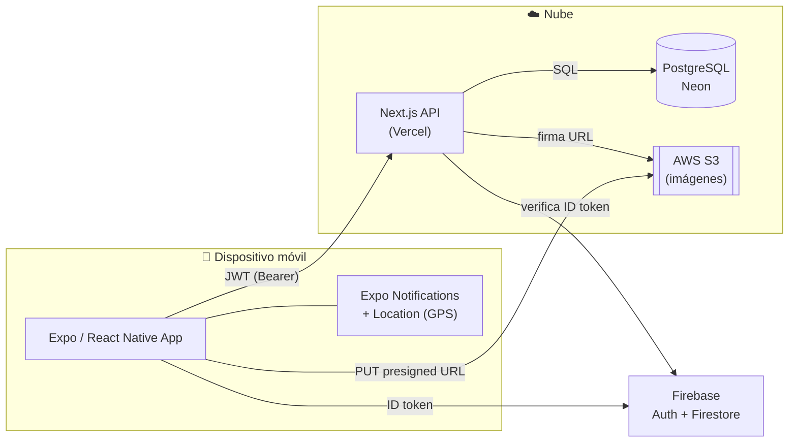

# NoteFlow — Mobile App

> Aplicación móvil nativa en **React Native (Expo)** para capturar notas, listas de
> tareas e ideas en un único flujo cronológico — **The Universal Flow** — con
> integraciones de hardware (GPS, notificaciones locales) y sincronización con una
> API y base de datos en la nube.

[](https://github.com/younes1819/NoteFlow/actions/workflows/test.yml)
[](https://expo.dev)
[](https://www.typescriptlang.org)
[](https://jestjs.io)

## Demo en vivo

- **Vídeo demo técnica (Loom, < 5 min):** _pendiente — pega aquí el enlace público de Loom_
  ([guión de la demo](docs/demo-loom.md))
- **Descarga APK:** _pendiente — enlaza la Release `v1.0.0` con el APK del perfil `preview`_

<!-- Coloca un GIF corto de la app funcionando bajo este título: -->
<!--  -->

## Arquitectura



> Diagrama editable en [`docs/arquitectura/diagrama.excalidraw`](docs/arquitectura/diagrama.excalidraw)
> (ábrelo en [excalidraw.com](https://excalidraw.com); si prefieres una imagen, expórtala a
> `docs/arquitectura/diagrama.png`). Detalle completo en
> [`docs/arquitectura/README.md`](docs/arquitectura/README.md).

| Componente | Tecnología | Despliegue |
|------------|------------|------------|
| App móvil | Expo / React Native + Expo Router | EAS Build → APK/AAB |
| Backend API | Next.js (App Router) | Vercel |
| Base de datos | PostgreSQL | Neon |
| Identidad y perfil | Firebase Auth + Firestore | Firebase |
| Archivos (avatares) | AWS S3 (presigned URLs) | AWS |

Flujo: la app autentica con **Firebase**, intercambia el ID token por un **JWT** propio
en la API, y opera las notas contra **PostgreSQL**. Las imágenes se suben directamente a
**S3** mediante URLs firmadas que emite el backend. Notificaciones y GPS se resuelven en el
dispositivo con módulos nativos de Expo.

## Funcionalidades nativas

- **Notificaciones locales** programadas como recordatorios (`expo-notifications`).
- **Geolocalización** con reverse geocoding para etiquetar notas (`expo-location`).
- **Animaciones a 60 FPS** en el UI thread (`react-native-reanimated`).
- **Swipe-to-delete** con gestos nativos (`react-native-gesture-handler`).
- **Feedback háptico** (`expo-haptics`) y listas de alto rendimiento (`FlashList`).
- **Accesibilidad**: roles, etiquetas y estados para VoiceOver/TalkBack.

## Calidad y testing

```bash
npm run lint        # ESLint — 0 errores, 0 warnings
npm run typecheck   # tsc --noEmit — 0 errores (strict)
npm test            # Jest — suite unitaria + integración
npm run test:coverage
```

- **Unitarios:** utilidades puras (`format`, `validation`, `typeGuards`) y store (`notesStore`).
- **Integración:** `NotasScreen` reaccionando a estado vacío/poblado y accesibilidad.
- **CI:** GitHub Actions ejecuta lint + typecheck + tests en cada push y PR.

## Stack

- **Expo SDK 56** + **Expo Router** (Tabs + Stack + Modal) + **TypeScript** (`strict`)
- **Gluestack UI v3** + **NativeWind** — design system monocromo
- **Zustand** — estado global (API como fuente de verdad)
- **Firebase Auth/Firestore** — identidad y perfil
- **expo-secure-store** — token JWT cifrado en keychain
- **Zod** — validación de formularios

## Ejecutar en local

```bash
# App móvil
npm install --legacy-peer-deps
cp .env.example .env       # EXPO_PUBLIC_API_URL apuntando a la API
npm start

# API (carpeta noteflow-api)
cd noteflow-api
npm install
cp .env.example .env.local # DATABASE_URL + JWT_SECRET + claves Firebase/AWS
npm run dev
```

> Las funciones nativas (Firebase, notificaciones, GPS) requieren un **Development Build**
> de EAS; no funcionan en Expo Go. Ver [`docs/fase-9-native.md`](docs/fase-9-native.md).

## Build de producción (EAS)

```bash
eas build --platform android --profile preview      # APK instalable
eas build --platform android --profile production    # AAB para la Play Store
```

## Decisiones de arquitectura (ADR)

- [ADR-0001 — Expo Managed Workflow vs React Native CLI](docs/adr/0001-expo-managed-workflow.md)
- [ADR-0002 — Zustand en lugar de Context API o Redux](docs/adr/0002-zustand-sobre-context-redux.md)
- [ADR-0003 — PostgreSQL + S3 frente a almacenarlo todo en Firebase](docs/adr/0003-postgres-s3-vs-firebase.md)

## Documentación

- [Idea y alcance del producto](docs/idea.md)
- [Gestión del proyecto (Kanban / Trello)](docs/project-management.md)
- [Fase 8 — Firebase + S3](docs/fase-8-firebase-s3.md)
- [Fase 9 — Funcionalidades nativas](docs/fase-9-native.md)
- [Fase 10 — Testing y build](docs/fase-10-testing-build.md)
- [API (Next.js + Neon)](noteflow-api/README.md)

## Estado

Aplicación completa de principio a fin: captura nativa, sincronización en la nube,
probada (lint + types + tests) y lista para empaquetar con EAS.
