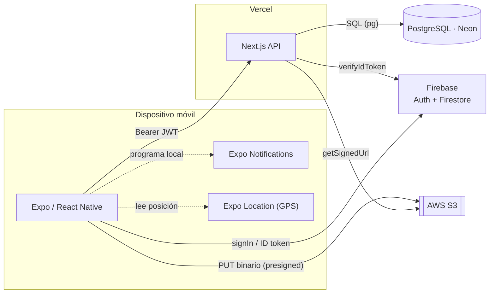

# Arquitectura del sistema — NoteFlow

NoteFlow es una app móvil **Expo/React Native** conectada a un backend en la nube. El
diseño separa cada responsabilidad en la herramienta más adecuada (ver
[ADR-0003](../adr/0003-postgres-s3-vs-firebase.md)).

## Actores

| Actor | Rol |
|-------|-----|
| **App móvil (Expo/RN)** | UI, captura, estado local (Zustand), gestos y animaciones |
| **Expo Notifications / Location** | Módulos nativos: recordatorios locales y GPS |
| **Firebase Auth + Firestore** | Identidad (login/registro) y perfil de usuario |
| **Next.js API (Vercel)** | Verifica el ID token, emite JWT, expone CRUD de notas, firma URLs de S3 |
| **PostgreSQL (Neon)** | Persistencia relacional de notas, ítems y etiquetas |
| **AWS S3** | Almacenamiento de imágenes (avatares) |

## Diagrama

## Flujos clave

### 1. Autenticación

1. La app hace login/registro con **Firebase Auth**.
2. Obtiene el **ID token** y lo envía a `POST /api/auth/firebase`.
3. El backend lo verifica con Firebase Admin, asegura la fila `users` (por `firebase_uid`)
   en PostgreSQL y devuelve un **JWT** propio.
4. La app guarda el JWT en `expo-secure-store` y lo usa como `Authorization: Bearer` en
   todas las llamadas de notas.

### 2. CRUD de notas

- `GET /api/notes`, `POST /api/notes`, `PATCH/DELETE /api/notes/:id` y endpoints de
  `checklist-items` operan contra PostgreSQL, filtrando por el `userId` del JWT.
- El esquema usa `ON DELETE CASCADE`: borrar una nota elimina sus ítems y tags.

### 3. Subida de imágenes (reto técnico)

1. La app pide al backend una **presigned URL** (`POST /api/uploads/presign`) con el ID token.
2. El backend valida y devuelve `{ signedUrl, publicUrl }`.
3. La app hace `PUT` del binario **directamente a S3** (no pasa por el servidor).
4. La `publicUrl` se guarda en el perfil de Firestore. Detalle en
   [fase-8-firebase-s3.md](../fase-8-firebase-s3.md).

### 4. Funcionalidades nativas

- **Notificaciones**: se programan en el dispositivo (`expo-notifications`), sin servidor.
- **Ubicación**: `expo-location` + reverse geocoding; las coordenadas se guardan junto a
  la nota en PostgreSQL.

## Editar el diagrama en Excalidraw

1. Abre [excalidraw.com](https://excalidraw.com).
2. Menú → *Open* → selecciona [`diagrama.excalidraw`](diagrama.excalidraw).
3. Ajusta lo que quieras y, si prefieres una imagen, *Export image* → PNG sobre
   `docs/arquitectura/diagrama.png`.
