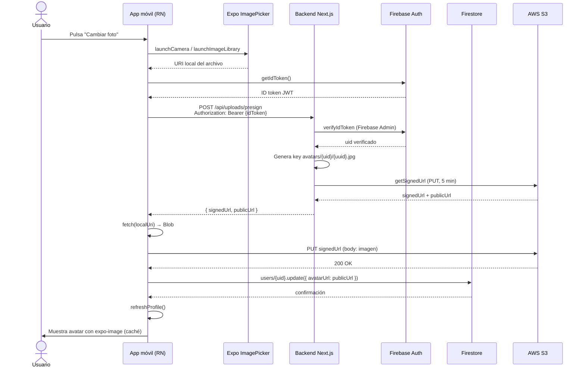

# Fase 8 — Autenticación Firebase, Firestore y subida a AWS S3

## Resumen

La app móvil identifica usuarios con **Firebase Auth**, guarda el perfil extendido en **Firestore** y sube imágenes (avatar) a **AWS S3** mediante URLs firmadas generadas por el backend Next.js (`noteflow-api`).

| Capa | Tecnología | Responsabilidad |
|------|------------|-----------------|
| Identidad | Firebase Auth | Registro, login, sesión persistente |
| Perfil | Firestore `users/{uid}` | Nombre, email, bio, `avatarUrl` |
| Notas | PostgreSQL + JWT | Datos de notas (sincronizados vía `/api/auth/firebase`) |
| Archivos | AWS S3 | Almacenamiento de imágenes |
| Backend | Next.js | Verificar token Firebase, emitir presigned URL |

## Flujo: de "Subir foto" a imagen en pantalla



## Pasos detallados

1. **Selección de imagen** — `AvatarPicker` pide permisos de cámara o galería y devuelve una URI local (`file://` o `content://`).
2. **Token de sesión** — La app obtiene el ID token de Firebase (`auth().currentUser.getIdToken()`).
3. **Presigned URL** — El backend verifica el token con Firebase Admin, genera una clave única en S3 y devuelve una URL firmada temporal (5 minutos) y la URL pública final.
4. **Subida directa** — La app hace `PUT` del blob a S3 sin pasar el archivo por el servidor (escalable y seguro).
5. **Persistencia del enlace** — Solo la URL pública se guarda en Firestore (`avatarUrl`), no el binario.
6. **Renderizado** — `AvatarImage` usa `expo-image` con `cachePolicy="memory-disk"` y placeholder mientras carga.

## Configuración requerida

### Firebase (app móvil)

1. Crear proyecto en [Firebase Console](https://console.firebase.google.com).
2. Activar **Authentication → Email/Password**.
3. Crear base de datos **Firestore** (modo producción o prueba).
4. Descargar `google-services.json` (Android) y `GoogleService-Info.plist` (iOS).
5. Colocarlos en la raíz del proyecto (plantillas en `*.example`).
6. Generar un **Development Build** con EAS — `@react-native-firebase` no funciona en Expo Go.

```bash
npx eas build --profile development --platform android
```

### Firebase Admin (backend)

En `noteflow-api/.env`, configurar la cuenta de servicio (Firebase → Project settings → Service accounts → Generate new private key).

### AWS S3

1. Crear bucket S3 con acceso público de lectura en el prefijo `avatars/` (o usar CloudFront).
2. Crear usuario IAM con permiso `s3:PutObject` en el bucket.
3. Configurar variables en `noteflow-api/.env` (ver `.env.example`).

### Base de datos

Ejecutar la migración para vincular usuarios Firebase con PostgreSQL:

```sql
-- noteflow-api/sql/migrations/002_firebase_uid.sql
```

## Archivos clave

| Archivo | Rol |
|---------|-----|
| `lib/firebase/auth.ts` | Login, registro, `onAuthStateChanged` |
| `lib/firebase/profile.ts` | CRUD perfil en Firestore |
| `lib/upload.ts` | Flujo presign + PUT a S3 |
| `store/authStore.ts` | Estado global de sesión |
| `app/_layout.tsx` | `AuthGate` con protección de rutas |
| `components/profile/AvatarPicker.tsx` | Cámara, galería y subida |
| `noteflow-api/app/api/uploads/presign/route.ts` | Generación de presigned URL |
| `noteflow-api/app/api/auth/firebase/route.ts` | Sincronización Firebase → JWT para notas |

## Notas

- En **web**, la app sigue usando JWT clásico (`/api/auth/login`) porque `@react-native-firebase` es solo nativo.
- Las notas siguen en PostgreSQL; Firebase gestiona identidad y perfil, no el contenido del flujo universal.
- Nunca commitear `google-services.json`, `GoogleService-Info.plist` ni claves AWS/Firebase.
