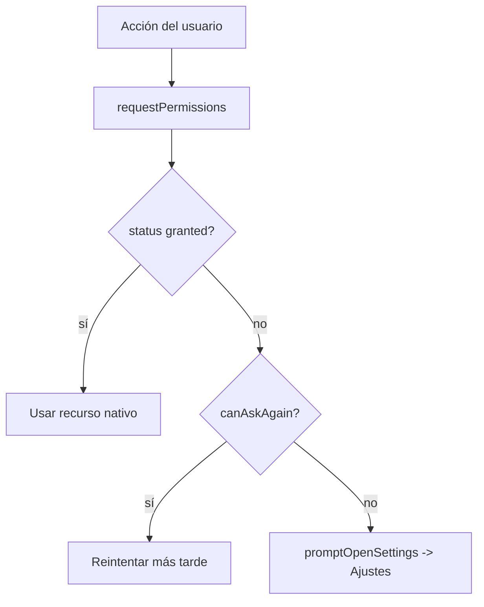

# Fase 9 — Funcionalidades nativas, animaciones y gestos

## Resumen

La app móvil incorpora capacidades nativas del dispositivo: **notificaciones locales** programadas, **geolocalización** por GPS, **animaciones a 60 FPS** en el hilo UI con Reanimated y **gestos** (swipe-to-delete) con Gesture Handler.

| Capa | Tecnología | Responsabilidad |
|------|------------|-----------------|
| Notificaciones | `expo-notifications` | Recordatorios locales programados sin servidor |
| Ubicación | `expo-location` | Lectura de GPS + reverse geocoding |
| Animaciones | `react-native-reanimated` | Entrada/salida de listas en el UI Thread |
| Gestos | `react-native-gesture-handler` | Swipe-to-delete en tiempo real |
| Permisos | `Linking` / `Alert` | Diálogo nativo + fallback a Ajustes |

## Modelo de permisos

Para acceder a hardware sensible (GPS, notificaciones) el SO exige consentimiento. Se contemplan dos escenarios:

1. **Primera solicitud** — El sistema muestra el diálogo nativo (`requestPermissionsAsync` / `requestForegroundPermissionsAsync`).
2. **Denegado permanentemente** (`canAskAgain === false`) — El SO ya no muestra el diálogo; la app detecta el caso y sugiere abrir Ajustes con `promptOpenSettings()` (`Linking.openSettings()` en Android, `app-settings:` en iOS).



## Notificaciones locales

Las notificaciones locales las programa el propio dispositivo y se entregan a la hora indicada, sin backend.

- **Handler** (`lib/notifications.ts`): define el comportamiento con la app abierta (banner, lista, sonido, sin badge).
- **Canal Android** `reminders`: inicializado en `app/_layout.tsx` vía `initNotifications()`.
- **Programar**: `scheduleReminder(noteId, title, date)` pide permiso, crea la notificación con trigger de tipo `DATE` y persiste el mapa `noteId → notificationId` en AsyncStorage.
- **Cancelar**: `cancelReminder(noteId)` se llama al eliminar cualquier nota/lista/idea (`store/notesStore.ts`).
- **UI**: en `app/nueva-nota.tsx`, chips de recordatorio (Sin recordatorio / En 1 hora / Mañana 9:00 / En 3 días) — solo para notas y fuera de web.

## Geolocalización

`getCurrentAddress()` (`lib/location.ts`) pide permiso de ubicación en primer plano, obtiene la posición y la convierte en dirección legible con `reverseGeocodeAsync`.

- Devuelve `{ latitude, longitude, locationName }`.
- **Backend**: columnas `latitude NUMERIC`, `longitude NUMERIC`, `location_name VARCHAR(255)` en la tabla `notes` (ver `sql/schema.sql` y migración `sql/migrations/003_note_location.sql`).
- **API**: `POST /api/notes` valida y persiste las coordenadas; `mapNoteRow` las convierte de `string` a `number`.
- **UI**: botón "AÑADIR UBICACIÓN" en `nueva-nota.tsx` (notas, listas e ideas) y badge `📍 {locationName}` en tarjetas y pantallas de detalle.

## Animaciones (Reanimated)

La `Animated` API estándar corre en el JS Thread y puede "tartamudear" si se bloquea. Reanimated mueve las animaciones al **UI Thread** nativo.

- `AnimatedCard` (`components/items/AnimatedCard.tsx`): entrada `FadeInDown` escalonada (`index * 40ms`) y salida `FadeOut`.
- Ítems de checklist en detalle (`app/(tabs)/checklists/[id].tsx`): `FadeInDown` escalonado al entrar.
- **Babel**: en Reanimated 4 el plugin es `react-native-worklets/plugin` (ya en `babel.config.js`).

## Gestos (Gesture Handler)

Combinando Gesture Handler + Reanimated se detecta el deslizamiento y se mueve el elemento en pantalla a 60 FPS sin pasar por el JS Thread.

- **Root**: la app está envuelta en `GestureHandlerRootView` (`app/_layout.tsx`).
- **`SwipeableRow`** (`components/gestures/SwipeableRow.tsx`): `Gesture.Pan()` que solo permite arrastrar a la izquierda; si supera el umbral (`-80px`) ejecuta `onDelete` con `runOnJS`, si no vuelve a su sitio con `withSpring`.
- **Uso**: swipe-to-delete en listas de notas, tareas e ideas (vía `AnimatedCard`) y en ítems individuales de checklist.

## Configuración de permisos (`app.json`)

| Plataforma | Configuración |
|------------|---------------|
| iOS | `NSLocationWhenInUseUsageDescription`, `UIBackgroundModes: ["remote-notification"]` |
| Android | Permisos `ACCESS_COARSE_LOCATION`, `ACCESS_FINE_LOCATION`, `POST_NOTIFICATIONS` |
| Plugins Expo | `expo-notifications` (icon), `expo-location` (mensaje de permiso) |

## Archivos clave

| Archivo | Rol |
|---------|-----|
| `lib/notifications.ts` | Handler, programar/cancelar recordatorios |
| `lib/location.ts` | GPS + reverse geocoding |
| `lib/permissions.ts` | Fallback a Ajustes cuando se deniega permiso |
| `components/gestures/SwipeableRow.tsx` | Gesto swipe-to-delete |
| `components/items/AnimatedCard.tsx` | Animaciones de entrada/salida + swipe |
| `app/nueva-nota.tsx` | UI de recordatorios y ubicación |
| `app/_layout.tsx` | `GestureHandlerRootView` + init de notificaciones |
| `noteflow-api/sql/migrations/003_note_location.sql` | Columnas de geolocalización |

## Cómo probar

En dispositivo físico o emulador (las notificaciones y el GPS no funcionan en web):

```bash
npx expo start
```

1. **Recordatorio** — Crear nota → elegir "En 1 hora" → guardar → llega la notificación a la hora.
2. **Ubicación** — Crear cualquier entrada → "AÑADIR UBICACIÓN" → conceder permiso → aparece `📍` en la tarjeta.
3. **Animaciones** — Abrir una lista; las tarjetas entran con fade-in escalonado.
4. **Swipe-to-delete** — Deslizar una tarjeta a la izquierda para eliminar; en checklist, deslizar un ítem individual.

## Notas

- Las funciones nativas se ocultan en `Platform.OS === 'web'`.
- `@react-native-firebase` y los módulos nativos requieren un **Development Build** (no Expo Go).
- El ID de cada notificación se guarda en AsyncStorage para poder cancelarla al borrar la nota.
